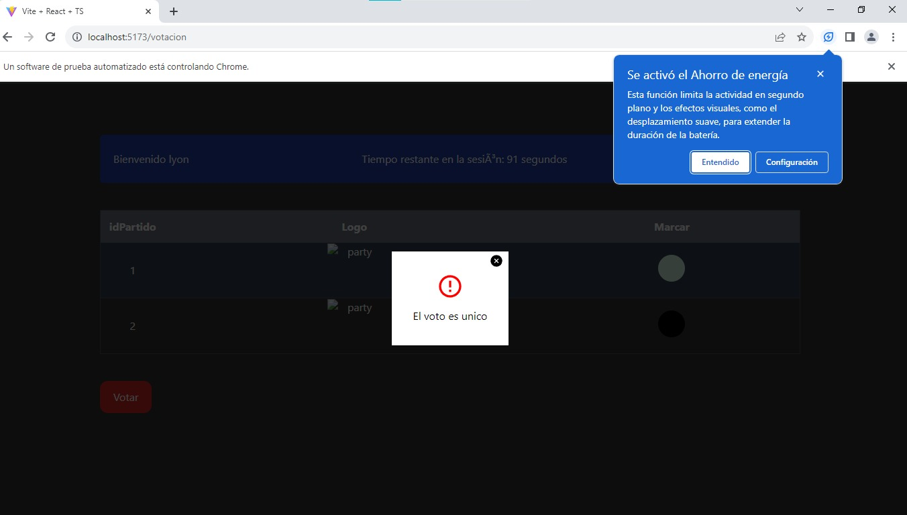

# Online Election

## Descripción
Online Election es una aplicación de votación en línea que utiliza Java para el backend y React con Vite para el frontend.

## Estructura del Proyecto
El proyecto está organizado en dos partes principales: backend y frontend.

## Microservicios Eureka

### Backend
La parte del servidor de la aplicación está construida con Java y utiliza Spring Boot. Aquí se gestionan las operaciones relacionadas con la lógica de negocio, la seguridad (Spring Security con JSON Web Token), y la conexión a una base de datos MySQL ubicada en la carpeta `database` junto con una base de datos en MongoDB en el microservicio "result" conforman la estrucutra backend del proyecto.

### Frontend
El frontend de la aplicación está construido con React y Vite. Proporciona una interfaz de usuario interactiva para que los usuarios participen en la votación en línea.

## Requisitos Previos
Asegúrate de tener instalados los siguientes requisitos previos en tu sistema antes de comenzar:

- Java Development Kit (JDK)
- Node.js y npm (Node Package Manager)

## Configuración y Ejecución

### Frontend
1. Navega a la carpeta `frontend` del proyecto.
2. Ejecuta el comando para construir y ejecutar el frontend:
   ```bash
   ./npm install  # instalar dependencias
   ./npm run dev  # iniciar frontend

### Backend
1. Navega a la carpeta `backend` del proyecto (donde se encuentra el archivo `pom.xml`).
2. Ejecuta el siguiente comando para construir y ejecutar el backend usando Maven:

   ```bash
   mvn spring-boot:run


   # Proyecto Online Election v2.0

Este repositorio contiene el código fuente y los scripts necesarios para construir, analizar y probar la aplicación Online Election v2.0. A continuación, se presenta un resumen del pipeline utilizado para llevar a cabo estas acciones.

## Requisitos previos

Asegúrese de tener instaladas las siguientes herramientas en su entorno de desarrollo:

- [Maven](https://maven.apache.org/) (v3.9.4)
- [Apache JMeter](https://jmeter.apache.org/) (v5.6.2)
- [Python](https://www.python.org/) (para ejecutar pruebas funcionales)

Además, se debe configurar un servidor SonarQube con la URL y token de autenticación correspondientes.

## Pipeline de CI/CD

El pipeline definido en Jenkins realiza diversas etapas, desde la clonación del repositorio hasta las pruebas de rendimiento. A continuación, se describen cada una de las etapas del pipeline:

### 1. **Clonación del repositorio**
   - Se realiza la clonación del repositorio desde la rama principal.

### 2. **Construcción del backend**
   - Utilizando Maven, se limpian los artefactos anteriores y se construye el backend de la aplicación.

### 3. **Análisis de SonarQube**
   - Se ejecuta un análisis estático del código fuente utilizando SonarQube.
   - La información clave, como el proyecto, la URL de SonarQube y el token de autenticación, se configuran como variables de entorno.


### 4. **Pruebas unitarias**
   - Se ejecutan las pruebas unitarias del backend mediante el comando `mvn test`.
   - Uso de junit y mockito
``` java
@RunWith(MockitoJUnitRunner.class)
public class JwtUtilsTest {

    @InjectMocks
    private JwtUtils jwtUtils;

    private UserDetailsImpl mockUserDetails;

    @Before
    public void setUp() {
        mockUserDetails = createMockUserDetails();
    }

    @After
    public void tearDown() {
        // Realizar limpieza después de cada prueba si es necesario
    }

    @Test
    public void testGenerateJwtToken() {
        Authentication authentication = mock(Authentication.class);
        when(authentication.getPrincipal()).thenReturn(mockUserDetails);

        String token = jwtUtils.generateJwtToken(authentication);

        assertNotNull(token);
        assertTrue(jwtUtils.validateJwtToken(token));
        assertEquals("testuser", jwtUtils.getUsernameFromJwtToken(token));
    }

    @Test
    public void testGenerateJwtTokenWithClaims() {
        Authentication authentication = mock(Authentication.class);
        when(authentication.getPrincipal()).thenReturn(mockUserDetails);

        Map<String, Object> claims = new HashMap<>();
        claims.put("key", "value");

        String token = jwtUtils.generateJwtToken(authentication, claims);

        assertNotNull(token);
        assertTrue(jwtUtils.validateJwtToken(token));
        assertEquals("testuser", jwtUtils.getUsernameFromJwtToken(token));
    }

    @Test
    public void testValidateJwtTokenValidToken() {
        Authentication authentication = mock(Authentication.class);
        when(authentication.getPrincipal()).thenReturn(mockUserDetails);

        String token = jwtUtils.generateJwtToken(authentication);

        assertTrue(jwtUtils.validateJwtToken(token));
    }

    @Test
    public void testValidateJwtTokenInvalidToken() {
        assertFalse(jwtUtils.validateJwtToken("invalidToken"));
    }

    private UserDetailsImpl createMockUserDetails() {
        return new UserDetailsImpl("1", "testuser", "testpassword", null);
    }
}
```

### 5. **Pruebas funcionales**
   - Se cambia al directorio de pruebas y se ejecutan las pruebas funcionales escritas en Python utilizando el comando `python -m unittest discover`.
   - Uso de python con selenium
```python
import time
import unittest
from selenium import webdriver
from selenium.webdriver.common.by import By
from selenium.webdriver.common.keys import Keys

class TestLoginApplication(unittest.TestCase):

    @classmethod
    def setUpClass(cls):
        # Configurar el WebDriver antes de todas las pruebas
        # Se ejecuta solo una vez
        pass

    def setUp(self):
        self.driver = webdriver.Chrome()
        self.driver.implicitly_wait(10)
        self.driver.get("http://localhost:5173/")
        self.driver.maximize_window()

        # Click on Login Button
        self.driver.find_element(By.XPATH, "//*[@id=\"root\"]/div/div[1]/div/a[2]").click()

        # Limpiar los campos de entrada antes de cada prueba
        try:
            # Limpiar los campos de entrada
            self.driver.find_element(By.NAME, "userName").clear()
            self.driver.find_element(By.NAME, "password").clear()
        except Exception as e:
            print("Error al limpiar campos de entrada:", e)

    def test_role_user(self):
        username = "aldito"
        password = "12345"

        # Ingresar el campo de usuario
        self.driver.find_element(By.NAME, "userName").send_keys(username)

        # Ingresar el campo de la contrasena
        self.driver.find_element(By.NAME, "password").send_keys(password)

        # Click login
        self.driver.find_element(By.XPATH, "//*[@id='root']/div/div/div[3]/button").click()

        time.sleep(2)

        # Get the Result Text based on its xpath
        result = self.driver.find_element(By.XPATH, "//*[@id=\'root\']/div/div[1]/div[1]").text

        # assert the value of result
        self.assertEqual("Bienvenido " + username, result)

    def test_role_admin(self):
        username = "gustav"
        password = "12345"

        # Ingresar el campo de usuario
        self.driver.find_element(By.NAME, "userName").send_keys(username)

        # Ingresar el campo de la contrasena
        self.driver.find_element(By.NAME, "password").send_keys(password)

        # Click login
        self.driver.find_element(By.XPATH, "//*[@id='root']/div/div/div[3]/button").click()

        time.sleep(2)

        # Get the Result Text based on its xpath
        result = self.driver.find_element(By.XPATH, "//*[@id=\'root\']/div/div[1]/div[1]").text

        # assert the value of result
        self.assertEqual("Bienvenido " + username, result)

    def test_user_invalid(self):
        username = "carlos"
        password = "12345"

        # Ingresar el campo de usuario
        self.driver.find_element(By.NAME, "userName").send_keys(username)

        # Ingresar el campo de la contrasena
        self.driver.find_element(By.NAME, "password").send_keys(password)

        # Click login
        self.driver.find_element(By.XPATH, "//*[@id='root']/div/div/div[3]/button").click()

        time.sleep(2)

        # Get the Result Text based on its xpath
        result = self.driver.find_element(By.XPATH, "//*[@id=\'root\']/div/div/h1").text

        # assert the value of result
        self.assertEqual("Credenciales inválidas", result)

    def tearDown(self):
        # No es necesario hacer nada aquí, ya que la limpieza se realiza en tearDownClass
        if self.driver:
            self.driver.close()
            self.driver.quit()

    @classmethod
    def tearDownClass(cls):
        # Cerrar el WebDriver después de todas las pruebas
        pass

if __name__ == "__main__":
    unittest.main()
```


### 6. **Pruebas de rendimiento**
   - Se ejecutan pruebas de rendimiento utilizando Apache JMeter.
   - El archivo de prueba se encuentra en la carpeta `performance-test/PruebaOnline.jmx`, y los resultados se guardan en `result.jtl`.
     
     

## Configuración del entorno

Asegúrese de configurar las siguientes variables de entorno antes de ejecutar el pipeline:

```groovy
M2_HOME = 'C:\\Program Files\\Maven\\apache-maven-3.9.4'
JMETER_HOME = 'D:\\A-UNSA\\IS_2\\LAB_06\\apache-jmeter-5.6.2'
PATH = "${JMETER_HOME}/bin:${PATH};${M2_HOME}/bin:${PATH}"

SONAR_URL = 'http://localhost:9000' // Reemplazar con la URL de su servidor SonarQube
SONAR_LOGIN = 'sqp_012a34c0113ddfc2165b0c1d827380452b228cd5' // Reemplazar con su token de autenticación de SonarQube
```

¡Ahora está listo para ejecutar el pipeline y contribuir al desarrollo del proyecto Online Election v2.0!

## PipeLine Integracion Continua

(https://www.youtube.com/watch?v=LwkvyKOG5EM)

## Git Project


